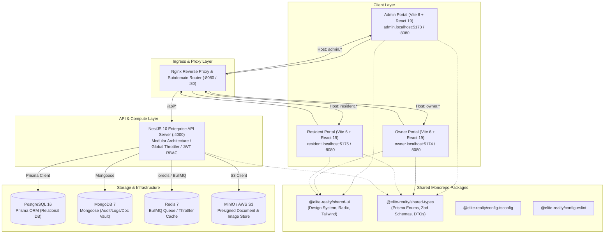
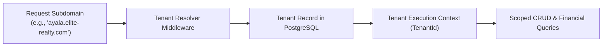
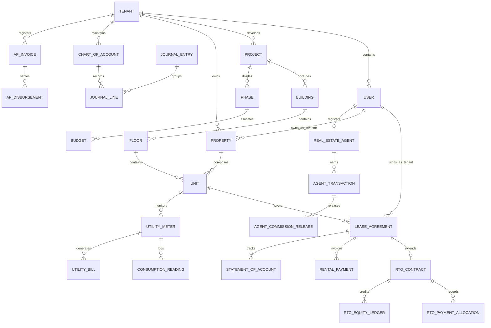
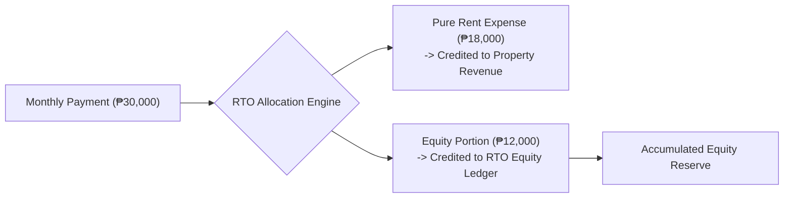
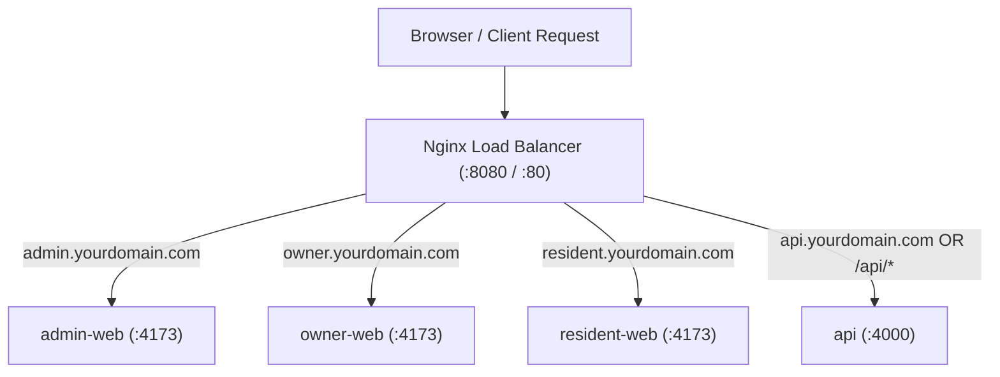

# 🏛️ Aetherouxe Estates (Elite Realty OS)

### Enterprise Multi-Tenant Real Estate ERP, Property Management, & Financial Settlement Platform

---

## 📑 Table of Contents

1. [Executive Overview & Platform Vision](#1-executive-overview--platform-vision)
2. [High-Level System Architecture](#2-high-level-system-architecture)
3. [Monorepo Workspace & Directory Topology](#3-monorepo-workspace--directory-topology)
4. [Multi-Tenancy, Identity & Role-Based Access Control (RBAC)](#4-multi-tenancy-identity--role-based-access-control-rbac)
5. [Database Architecture & Domain Data Model](#5-database-architecture--domain-data-model)
6. [Core Computational Engines & Mathematical Formulations](#6-core-computational-engines--mathematical-formulations)
   - [6.1 Sales Scheme & Installment Financing Engine](#61-sales-scheme--installment-financing-engine)
   - [6.2 Rent-To-Own (RTO) Equity Accumulation & Settlement](#62-rent-to-own-rto-equity-accumulation--settlement)
   - [6.3 Mortgage Amortization & Scenario Engine](#63-mortgage-amortization--scenario-engine)
   - [6.4 Brokerage Commission Splitting & Aging Matrix](#64-brokerage-commission-splitting--aging-matrix)
   - [6.5 Utility Consumption & Billing Computation](#65-utility-consumption--billing-computation)
   - [6.6 Centralized Collision-Free Numbering & Sequence Engine](#66-centralized-collision-free-numbering--sequence-engine)
   - [6.7 Double-Entry General Ledger & Automated Accounting Mappings](#67-double-entry-general-ledger--automated-accounting-mappings)
7. [Backend API Architecture (`apps/api`)](#7-backend-api-architecture-appsapi)
8. [Frontend Portals & Client Applications](#8-frontend-portals--client-applications)
   - [8.1 Admin Management Portal (`apps/admin-web`)](#81-admin-management-portal-appsadmin-web)
   - [8.2 Owner / Investor Portal (`apps/owner-web`)](#82-owner--investor-portal-appsowner-web)
   - [8.3 Resident & Tenant Portal (`apps/resident-web`)](#83-resident--tenant-portal-appsresident-web)
   - [8.4 Shared Component & Design System (`packages/shared-ui`)](#84-shared-component--design-system-packagesshared-ui)
   - [8.5 Shared Type Definitions & Schemas (`packages/shared-types`)](#85-shared-type-definitions--schemas-packagesshared-types)
9. [Pre-Seeded Accounts, Credentials & Test Personas](#9-pre-seeded-accounts-credentials--test-personas)
10. [Environment Variables & Configuration Matrix](#10-environment-variables--configuration-matrix)
11. [Local Development & Setup Guide](#11-local-development--setup-guide)
12. [Testing & Quality Assurance Suites](#12-testing--quality-assurance-suites)
13. [Production Deployment, Containerization & Reverse Proxy](#13-production-deployment-containerization--reverse-proxy)
14. [Security, Performance & Operational Runbooks](#14-security-performance--operational-runbooks)
15. [Troubleshooting & Frequently Asked Questions (FAQ)](#15-troubleshooting--frequently-asked-questions-faq)

---

# 1. Executive Overview & Platform Vision

**Aetherouxe Estates** (internally structured as the **Elite Realty Monorepo**) is an enterprise-grade, end-to-end Real Estate ERP, Asset Operations, and Financial Settlement Operating System. Engineered specifically to bridge the fragmented software landscape of modern property developers, asset holding companies, condominium corporations, real estate brokerages, and estate operators, Aetherouxe centralizes the entire lifecycle of physical and financial real estate assets.

```
+-------------------------------------------------------------------------------------------------------+
|                                    AETHEROUXE ESTATES ECOSYSTEM                                       |
+-----------------------------------+-----------------------------------+-------------------------------+
|       DEVELOPER & SALES           |       OPERATIONS & ASSETS         |     FINANCIAL SETTLEMENT      |
+-----------------------------------+-----------------------------------+-------------------------------+
| * Project & Master Planning       | * Unit Inventory Lifecycle        | * Double-Entry General Ledger |
| * Phase & Budget Line Control     | * Multi-Tenant Subdomain Routing  | * Automated AP/AR Invoicing   |
| * Custom Sales Scheme Engine      | * Preventive Maintenance Tickets  | * Rent-to-Own (RTO) Ledgers   |
| * Tiered Commission Distribution  | * Utility Metering & Automated CR | * Bank Mortgage Amortization  |
| * Lead-to-Contract Pipeline       | * Amenity Booking Engine          | * Aging Buckets & Collections |
| * Title Transfer Legal Handover   | * Document Vault & E-Signatures   | * Owner Yield & P&L Reporting |
+-----------------------------------+-----------------------------------+-------------------------------+
```

### Key Pillars

1. **Developer Project & Construction Budgeting**: Multi-phase tracking from raw land acquisition and architectural design to contractor engagements and milestone disbursement approvals.
2. **Dynamic Transaction Schemes**: First-class support for **Spot Cash**, **In-House Installment (DP + Equity + Balance)**, **Bank/Pag-IBIG Mortgage-Assisted**, **Standard Lease Agreements**, and progressive **Rent-to-Own (RTO)** programs.
3. **Automated Double-Entry Accounting**: Real-time journal line generation for operational events (work orders, commission accruals, rent invoices, disbursements) mapped against an enterprise Chart of Accounts.
4. **Brokerage & Commission Engine**: Multi-tier agent hierarchy (Junior, Senior, Team Lead, External Broker) with automated milestone releases, withholding tax handling, and license compliance monitoring.
5. **Unified Multi-Portal User Experience**: Three distinct web applications tailored for Estate Administrators, Unit Owners/Investors, and Resident Tenants.

---

# 2. High-Level System Architecture

Aetherouxe is built on a high-throughput, horizontally scalable, multi-tenant monorepo architecture managed by **Turborepo** and powered by **Node.js (>= 22.0.0)**.



---

# 3. Monorepo Workspace & Directory Topology

```
reps/
├── apps/
│   ├── admin-web/               # Administration & Executive Control Center (Vite + React 19)
│   │   ├── src/
│   │   │   ├── components/      # Admin specific UI components (Sidebar, TopNav, Filters, Dialogs)
│   │   │   ├── hooks/           # Data fetching and UI state hooks (TanStack Query integrations)
│   │   │   ├── lib/             # API client, Axios interceptors, formatters, utilities
│   │   │   ├── pages/           # 70+ Domain Pages (Properties, GL, AR Aging, Commissions, etc.)
│   │   │   ├── router.tsx       # TanStack Router configuration and route tree
│   │   │   ├── main.tsx         # React root entrypoint with QueryClient and ThemeProvider
│   │   │   └── index.css        # Tailwind CSS root stylesheet
│   │   ├── package.json
│   │   ├── tsconfig.json
│   │   └── vite.config.ts
│   │
│   ├── owner-web/               # Investor & Landlord Portfolio Portal (Vite + React 19)
│   │   ├── src/
│   │   │   ├── components/      # Financial summaries, asset valuation cards, P&L breakdown
│   │   │   ├── pages/           # 9+ Owner Views (Dashboard, Properties, Financials, PnL, Projects)
│   │   │   ├── router.tsx       # Owner-specific client router
│   │   │   └── main.tsx
│   │   ├── package.json
│   │   └── vite.config.ts
│   │
│   ├── resident-web/            # Tenant & Resident Living Portal (Vite + React 19)
│   │   ├── src/
│   │   │   ├── components/      # Lease status cards, RTO equity meters, utility graphs, forum
│   │   │   ├── pages/           # 14+ Resident Views (Dashboard, Lease, RTO, Bills, Amenities, Requests)
│   │   │   ├── router.tsx       # Resident-specific client router
│   │   │   └── main.tsx
│   │   ├── package.json
│   │   └── vite.config.ts
│   │
│   └── api/                     # Core NestJS 10 Backend API Server
│       ├── prisma/
│       │   ├── schema.prisma    # Primary PostgreSQL schema (50+ models, 30+ enums, full indexes)
│       │   ├── seed.ts          # Comprehensive Filipino real estate test dataset generator
│       │   └── tsconfig.seed.json
│       ├── src/
│       │   ├── agents/          # Real estate agent profile management and licensing
│       │   ├── agent-transactions/ # Sales/Lease transactions linked to agents
│       │   ├── ap-invoices/     # Accounts Payable invoice lifecycle and disbursements
│       │   ├── ar-aging/        # Accounts Receivable aging calculation (0-30, 31-60, 61-90, 90+)
│       │   ├── auth/            # JWT Strategy, Local Strategy, Guards, Token Versioning
│       │   ├── budgets/         # Project budgeting, versioning, and line item tracking
│       │   ├── buildings/       # Building definitions within projects
│       │   ├── code-sequence/   # Collison-free sequential identifier generator
│       │   ├── collection-activities/ # Dunning calls, site visits, legal notices
│       │   ├── collection-cases/     # Delinquent account case management
│       │   ├── commission-aging/     # Commission payout aging calculations
│       │   ├── commission-releases/  # Milestone commission payout authorizations
│       │   ├── commissions/          # Commission rule matrix engine
│       │   ├── common/          # Global filters, decorators, interceptors, RBAC guards
│       │   ├── community/       # Announcements, posts, comments, moderation pipeline
│       │   ├── company-owner/   # Default company owner portfolio resolution
│       │   ├── consumption-readings/ # Sub-meter reading logs (water/electricity)
│       │   ├── contractor-engagements/ # Vendor contracts mapped to budget line items
│       │   ├── contractors/     # Contractor vendor registry
│       │   ├── documents/       # Document Vault and digital signature workflows
│       │   ├── floors/          # Building floor level management
│       │   ├── general-ledger/  # Chart of Accounts, Journal Entries, Double-Entry Lines
│       │   ├── images/          # Image upload and asset association
│       │   ├── leads/           # CRM Lead tracking and prospect conversion
│       │   ├── leases/          # Master Lease Agreements (Rental, Installment, RTO)
│       │   ├── ledger/          # Ledger balance queries and aggregation
│       │   ├── mongodb/         # MongoDB connection and audit schemas
│       │   ├── mortgage/        # Amortization generator and mortgage scenario comparison
│       │   ├── notifications/   # Multi-channel notification pipeline
│       │   ├── numbering-engine/# Automated reference code formatter
│       │   ├── owner-pnl/       # Owner Net Income and Yield calculation engine
│       │   ├── owner-portal/    # Owner-specific composite endpoints
│       │   ├── payment-reminders/ # Pre-due and overdue payment notice dispatcher
│       │   ├── phases/          # Development project phase sequencing
│       │   ├── prisma/          # PrismaService singleton and connection hooks
│       │   ├── projects/        # Master development project management
│       │   ├── properties/      # Property master inventory (Houses, Condos, Commercial)
│       │   ├── rental-payments/ # Lease payment recording and reconciliation
│       │   ├── reports/         # Executive analytics, sales, and collection reports
│       │   ├── reservations/    # Unit reservation and holding fee engine
│       │   ├── rewards/         # Tenant loyalty reward catalog and point ledgers
│       │   ├── roles/           # Dynamic RBAC roles and permission management
│       │   ├── rto/             # Rent-To-Own equity ledger and option exercise engine
│       │   ├── sales/           # Sales transactions and payment milestones
│       │   ├── schemes/         # Pricing and financial transaction scheme templates
│       │   ├── search/          # Global fuzzy search across all entities
│       │   ├── service-requests/# Maintenance ticketing and work order dispatch
│       │   ├── settings/        # Tenant configuration, locale, and branding
│       │   ├── statements/      # Statement of Account (SOA) generator
│       │   ├── titles/          # Title transfer and ownership handover workflows
│       │   ├── units/           # Granular unit inventory, pricing, and specs
│       │   ├── users/           # User lifecycle, authentication profiles
│       │   ├── utility-bills/   # Automated bill generator based on consumption readings
│       │   ├── utility-meters/  # Utility sub-meter registry and multiplier tracking
│       │   ├── app.module.ts    # Root NestJS application module
│       │   └── main.ts          # Server bootstrap, Swagger setup, CORS, Helmet
│       ├── package.json
│       └── tsconfig.json
│
├── packages/
│   ├── shared-types/            # Shared TypeScript Enums, Interfaces, and Zod Schemas
│   │   ├── src/
│   │   │   ├── enums.ts         # Direct mirror of Prisma enums for frontend consumption
│   │   │   ├── schemas.ts       # Shared validation schemas
│   │   │   └── index.ts
│   │   └── package.json
│   │
│   ├── shared-ui/               # Shared Radix UI & Tailwind CSS Component Library
│   │   ├── src/
│   │   │   ├── components/      # Buttons, Inputs, Tables, Modals, Badges, Tabs, Tooltips
│   │   │   ├── hooks/           # useAuth, useTenant, useApi, useMediaQuery
│   │   │   ├── lib/             # cn (tailwind-merge / clsx), currency formatters
│   │   │   └── index.ts
│   │   └── package.json
│   │
│   ├── config-eslint/           # Shared ESLint configuration presets
│   └── config-tsconfig/         # Shared TypeScript compiler options (Base, React, Node)
│
├── docker/                      # Container configuration files
├── nginx/                       # Nginx reverse proxy Dockerfile and configuration
├── scripts/
│   ├── generate-enums.mjs       # Generates TypeScript enum exports from schema.prisma
│   ├── reseed.ps1               # Automated database teardown and seed script
│   ├── scaffold.cjs             # Code generator for NestJS modules and CRUD endpoints
│   └── smoke.mjs                # Smoke test suite validating all API routes
├── e2e/                         # Playwright end-to-end test specifications
├── docker-compose.yml           # Local development infrastructure stack (Postgres, Mongo, Redis, MinIO)
├── docker-compose.prod.yml      # Production stack with Nginx reverse proxy and subdomains
├── Dockerfile.unified           # Production monolithic container build
├── Dockerfile.web               # Production frontend build template
├── dev.ps1                      # Windows PowerShell development launcher
├── build.ps1                    # Monorepo build script
├── turbo.json                   # Turborepo task pipeline configuration
└── package.json                 # Monorepo root workspace configuration
```

---

# 4. Multi-Tenancy, Identity & Role-Based Access Control (RBAC)

Aetherouxe operates a rigorous multi-tenant data architecture. Every entity within the database (properties, users, leases, journal lines, invoices) is scoped by a `tenantId` foreign key referencing the `tenants` table.



### 4.1 Tenancy Resolution & Portfolio Ownership

- **Tenant Domain Isolation**: Tenants have unique domains (`domain` column). Incoming HTTP requests determine tenant context via subdomain headers, custom host headers, or user JWT payloads.
- **Company Owner Model**: Each tenant maintains a designated `companyOwnerId` referencing a system user (e.g., `portfolio@domain`). This user acts as the default owner of record for unsold inventory, unallocated leases, and corporate asset holdings.

### 4.2 User Types & Permission Hierarchy

| UserType               | Target Portal  | Primary Responsibilities & Permissions                                                                                                               |
| :--------------------- | :------------- | :--------------------------------------------------------------------------------------------------------------------------------------------------- |
| **`super_admin`**      | `admin-web`    | Complete system access; tenant settings; chart of accounts; roles; financial mappings; project creations; inventory management; user administration. |
| **`admin`**            | `admin-web`    | Operational administration; leasing approvals; contractor management; service request dispatching; community moderation.                             |
| **`property_manager`** | `admin-web`    | Day-to-day estate operations; meter readings; work order executions; unit inspections; amenity booking approvals.                                    |
| **`finance`**          | `admin-web`    | Full access to General Ledger, AR/AP, Invoicing, Billing, Payment Arrangements, Commission Releases, and P&L Statements.                             |
| **`agent`**            | `admin-web`    | Brokerage sales portal; lead management; pipeline conversion; commission tracking; license renewal tracking.                                         |
| **`owner`**            | `owner-web`    | Asset performance portal; property portfolio valuation; rental income tracking; P&L statements; yield analysis; document vaults.                     |
| **`tenant`**           | `resident-web` | Resident portal; lease agreements; online payment submission; RTO equity progress; utility billing; amenity reservations; service ticketing.         |

### 4.3 Authentication & Security Architecture

- **JWT Access & Refresh Tokens**: High-entropy JWT tokens carrying `sub` (userId), `tenantId`, `userType`, and `tokenVersion`.
- **Token Invalidation via `tokenVersion`**: Single-click password resets or logout-all-devices immediately increments `tokenVersion` on the `User` model, invalidating all outstanding access tokens without requiring distributed blocklists.
- **Bcrypt Password Hashing**: Adaptive work factor (12 rounds) for salted cryptographic hashing.

---

# 5. Database Architecture & Domain Data Model

The primary data store is **PostgreSQL 16** managed via **Prisma ORM 5**. The schema contains over 50 normalized relational models, optimized with compound multi-tenant indexes (`[tenantId, createdAt]`, `[tenantId, status]`).



### Summary of Core Relational Entity Domains

#### 1. Real Estate Inventory & Hierarchy

- **`Tenant`**: Multi-tenant root container storing branding, company legal data, currency (`PHP`), timezone (`Asia/Manila`), and feature toggles.
- **`Project`**: Master development project (High-Rise, Mid-Rise, Village, Township, Commercial Complex) with target start/completion schedules.
- **`Phase`**: Sub-phase of development controlling budget milestones and construction delivery.
- **`Building` & `Floor`**: Physical structures, address details, architectural floor plans, and sort orders.
- **`Unit`**: Granular marketable entity with square meters, bedroom/bathroom counts, balcony/parking flags, facing direction, list price, lot value, and building value.
- **`Property`**: Asset holding record aggregating units, associated with project and owner records.

#### 2. Master Sales Schemes & Transactions

- **`Scheme`**: Comprehensive sales terms defining transaction mechanics (Spot Cash, Installment, Mortgage-Assisted, Standard Lease, RTO), downpayment percentages, equity amortizations, miscellaneous balance percentages, and agent commission structures.
- **`Reservation`**: Prospect holding engine with lock timers, option fees, and conversion to active lease agreements.
- **`LeaseAgreement`**: Legally binding contract defining monthly rent, security deposits, grace periods, penalty percentages, and associated schemes.
- **`RentalPayment`**: Billing period payment records tracking payment references, late penalties, and reconciliation states.

#### 3. Rent-to-Own (RTO) & Mortgage Engine

- **`RtoContract`**: Tracks total contract value, option fees, accumulated equity, monthly equity allocations, and exercise dates.
- **`RtoPaymentAllocation`**: Breaks down individual rent checks into pure rental income vs equity accumulation.
- **`RtoEquityLedger`**: Audit trail of earned equity, interest adjustments, or debit deductions.
- **`MortgageScenario` & `MortgageAmortizationSchedule`**: Amortization schedules computing beginning balance, monthly principal, monthly interest, cumulative interest, and ending balance.

#### 4. Brokerage & Agent Hierarchy

- **`RealEstateAgent`**: Agent registry with PRC license number, TIN, default commission rates, tier (Junior, Senior, Team Lead, External Broker), and hierarchical manager references.
- **`AgentCommission`**: Dynamic commission rule matrices based on property type, project, and agent tier.
- **`AgentTransaction`**: Computed commission amounts linked to property sales or lease agreements.
- **`AgentCommissionRelease`**: Milestone disbursement tracker with aging bucket categorization.
- **`AgentLicenseRenewal`**: Continuing Professional Education (CPE) unit tracking and compliance alerts.

#### 5. Accounts Receivable, Collections & Delinquency

- **`ArInvoice` & `ArPayment`**: Invoices for rent, water, electricity, association dues, and late charges.
- **`ArPaymentArrangement` & `ArArrangementInstallment`**: Restructuring agreements for delinquent tenants.
- **`CollectionCase` & `CollectionActivity`**: Dunning workflow tracker logging calls, reminder emails, SMS alerts, demand letters, and site visits.
- **`StatementOfAccount`**: Formal billing statements reflecting opening balance, total billed, total paid, and closing balance.

#### 6. Utilities & Sub-metering

- **`UtilityMeter`**: Physical sub-meters (Water, Electricity) with serial numbers and multipliers.
- **`ConsumptionReading`**: Periodic reader entries with previous and present values.
- **`UtilityBill`**: Computed bills using effective rate matrices and base service charges.
- **`UtilityRate`**: Temporal rate schedules per unit consumption.

#### 7. General Ledger & Double-Entry Accounting

- **`ChartOfAccount`**: Multi-tenant chart of accounts (`Asset`, `Liability`, `Equity`, `Revenue`, `Expense`).
- **`JournalEntry` & `JournalLine`**: Double-entry ledger lines ensuring mathematical parity ($\sum \text{Debits} = \sum \text{Credits}$).
- **`FinancialMapping`**: System event triggers mapping operational actions (`WORK_ORDER_COMPLETED`, `COMMISSION_APPROVED`, `SALE_CONTRACT_SIGNED`) directly to accounting codes.
- **`ApInvoice` & `ApDisbursement`**: Vendor accounts payable tracking.

#### 8. Operations, Community & Resident Experience

- **`ServiceRequest` & `MaintenanceWorkOrder`**: Resident ticketing and contractor work order dispatch.
- **`Amenity` & `AmenityBooking`**: Facilities management (Clubhouse, Gym, Pool, Function Rooms) with capacity and hourly rate rules.
- **`CommunityPost`, `PostComment`, `PostReport`, `ModerationLog`**: Social hub with automated moderation.
- **`DocumentVault` & `DocumentSignature`**: Secure repository with e-signature tracking.
- **`RewardItem` & `RewardPointLedger`**: Resident gamification and on-time payment reward points.
- **`TitleTransfer`**: Legal title transfer workflow from developer to buyer.

---

# 6. Core Computational Engines & Mathematical Formulations

### 6.1 Sales Scheme & Installment Financing Engine

Aetherouxe implements a parameterized calculation engine covering five distinct purchase modes:

```
+---------------------------------------------------------------------------------------------------+
| Total Contract Price (TCP) = Unit List Price + Lot Value + Building Value                         |
+---------------------------------------------------------------------------------------------------+
```

#### A. Spot Cash Mode

Full upfront purchase with cash discount:
$$\text{Net Payable} = \text{TCP} \times (1 - \text{DiscountPercent})$$

#### B. Installment Mode (Downpayment + Equity + Balance)

The platform slices the Total Contract Price into three structured phases:

1. **Downpayment (DP) Phase**:
   $$\text{DP Total} = \text{TCP} \times \text{EqDownpaymentPercentage}$$
   $$\text{Monthly DP} = \frac{\text{DP Total}}{\text{dpNumberOfPayments}}$$

2. **Equity (EQ) Amortization Phase**:
   $$\text{Equity Total} = \text{TCP} \times \text{EqPaymentPercentage} \times (1 - \text{EqDiscountPercentage})$$
   $$\text{Monthly Equity} = \frac{\text{Equity Total}}{\text{eqNumberOfPayments}}$$

3. **Balance (BL) Phase (In-House or Bank Financing)**:
   $$\text{Balance Principal} = \text{TCP} \times \text{BlPaymentPercentage}$$
   $$\text{Misc / Transfer Fees} = \text{TCP} \times \text{BlMiscPercentage}$$
   $$\text{Final Balance} = \text{Balance Principal} + \text{Misc / Transfer Fees}$$

---

### 6.2 Rent-To-Own (RTO) Equity Accumulation & Settlement

Under the RTO program, monthly lease remittances are bifurcated into a non-recoverable rental expense and an equity credit:



- **Monthly Rent Portion**:
  $$\text{Rent Amount} = \text{Total Monthly Payment} \times (1 - \text{EquityAccumulationPercent})$$
- **Monthly Equity Portion**:
  $$\text{Equity Amount} = \text{Total Monthly Payment} \times \text{EquityAccumulationPercent}$$
- **Option Purchase Exercise**:
  Upon reaching maturity, the purchase balance is computed:
  $$\text{Final Acquisition Price} = \text{Total Contract Value} - (\text{Option Fee} + \text{Total Accumulated Equity})$$

---

### 6.3 Mortgage Amortization & Scenario Engine

The mortgage engine provides fixed-rate, annuity-style amortization schedules.

Given:

- $P$ = Loan Principal Amount
- $r$ = Annual Nominal Interest Rate (percentage, e.g., $7.5\%$)
- $n$ = Loan Term in Months
- $i$ = Periodic Monthly Interest Rate = $\frac{r}{100 \times 12}$

#### Monthly Amortization Formula:

$$M = P \times \frac{i(1 + i)^n}{(1 + i)^n - 1} \quad (\text{for } i > 0)$$

For each monthly period $k \in [1, n]$:

1. **Interest Due**:
   $$I_k = \text{Beginning Balance}_k \times i$$
2. **Principal Due**:
   $$P_k = M - I_k$$
3. **Ending Balance**:
   $$\text{Ending Balance}_k = \text{Beginning Balance}_k - P_k$$
4. **Final Month Balancing**:
   On month $k = n$, to prevent rounding drift:
   $$P_n = \text{Beginning Balance}_n, \quad M_n = P_n + I_n, \quad \text{Ending Balance}_n = 0$$

All intermediate financial figures are rounded to 2 decimal places using bankers' rounding algorithms.

---

### 6.4 Brokerage Commission Splitting & Aging Matrix

Commissions are computed on transaction closing and disbursed across project milestones:

$$\text{Gross Commission} = \text{Transaction Value} \times \text{CommissionRate}$$

#### Hierarchical Split Distribution:

```
+-------------------------------------------------------------+
| Gross Commission = 100% (e.g., 5.0% of TCP)                 |
+-----------------------------------+-------------------------+
| Primary Agent (Junior / Senior)   | 70% of Gross Commission |
| Team Lead / Managing Broker       | 20% of Gross Commission |
| Corporate Brokerage Override      | 10% of Gross Commission |
+-----------------------------------+-------------------------+
```

#### Aging Buckets for Receivables & Commissions:

- **Current (0 - 30 Days)**: Freshly accrued, pending client milestone payment.
- **Aging 31 - 60 Days**: Milestone cleared, ready for release voucher creation.
- **Aging 61 - 90 Days**: Overdue for payout processing.
- **Delinquent (90+ Days)**: Subject to broker dispute or delayed developer disbursement.

---

### 6.5 Utility Consumption & Billing Computation

Sub-metered water and electricity charges are calculated via temporal rate tables:

$$\text{Net Consumption} = (\text{Current Reading} - \text{Previous Reading}) \times \text{Meter Multiplier}$$
$$\text{Total Utility Amount} = (\text{Net Consumption} \times \text{RatePerUnit}) + \text{Base Charge}$$

---

### 6.6 Centralized Collision-Free Numbering & Sequence Engine

All business codes are generated by the atomic `SequenceCounter` engine in `apps/api/src/code-sequence/`:

| Business Entity     | Key Pattern       | Example Output    |
| :------------------ | :---------------- | :---------------- |
| **AR Invoice**      | `ar_invoice`      | `INV-2026-00042`  |
| **AP Invoice**      | `ap_invoice`      | `AP-2026-00018`   |
| **Lease Agreement** | `lease`           | `LSE-2026-00109`  |
| **Reservation**     | `reservation`     | `RES-2026-00055`  |
| **Collection Case** | `collection_case` | `CASE-2026-00012` |
| **Title Transfer**  | `title_transfer`  | `TTL-2026-00007`  |

---

### 6.7 Double-Entry General Ledger & Automated Accounting Mappings

When operational events occur, the system generates atomic double-entry journal transactions:

```
Transaction: WORK_ORDER_COMPLETED (Maintenance Repairs: ₱4,500.00)
-------------------------------------------------------------------
Debit  | Account 5000 (Maintenance Expense) | ₱4,500.00
Credit | Account 2000 (Accounts Payable)     | ₱4,500.00

Transaction: SALE_CONTRACT_SIGNED (Spot Cash Sale: ₱5,000,000.00)
-------------------------------------------------------------------
Debit  | Account 1200 (Accounts Receivable) | ₱5,000,000.00
Credit | Account 4100 (Sales Income)        | ₱5,000,000.00
```

---

# 7. Backend API Architecture (`apps/api`)

Built on **NestJS 10**, the backend implements a clean, modular architecture. Every business subdomain is encapsulated within its own NestJS module with dedicated controllers, services, and DTOs.

```
NestJS Application Core
├── Global Interceptors: ClassSerializerInterceptor, LoggingInterceptor
├── Global Pipes: ValidationPipe (whitelist: true, transform: true)
├── Global Guards: ThrottlerGuard (60 req/min) -> JwtAuthGuard -> RolesGuard
└── Global Filters: PrismaClientExceptionFilter, HttpExceptionFilter
```

### Complete Inventory of NestJS API Modules (54 Submodules)

| Module                            | Route Prefix              | Key Responsibilities                                                |
| :-------------------------------- | :------------------------ | :------------------------------------------------------------------ |
| **`AuthModule`**                  | `/auth`                   | Login, registration, token refresh, profile query, password update. |
| **`UsersModule`**                 | `/users`                  | User management, status toggling, role assignment.                  |
| **`RolesModule`**                 | `/roles`                  | Dynamic permission management and custom role definitions.          |
| **`PropertiesModule`**            | `/properties`             | Property registry, hierarchy, specs, owner binding.                 |
| **`ProjectsModule`**              | `/projects`               | Master project definitions, types, schedules, logos.                |
| **`PhasesModule`**                | `/phases`                 | Project construction phases and order sequencing.                   |
| **`BuildingsModule`**             | `/buildings`              | Building structures, addresses, floor counts.                       |
| **`FloorsModule`**                | `/floors`                 | Floor levels and architectural layout attachments.                  |
| **`UnitsModule`**                 | `/units`                  | Granular unit inventory, pricing, availability toggles.             |
| **`SchemesModule`**               | `/schemes`                | Pricing schemes (Cash, Installment, Mortgage, RTO).                 |
| **`ReservationsModule`**          | `/reservations`           | Unit reservations, option fees, expiration management.              |
| **`LeasesModule`**                | `/leases`                 | Master lease contracts, terms, penalties, document links.           |
| **`RentalPaymentsModule`**        | `/rental-payments`        | Payment records, late fee applications, receipt logs.               |
| **`RtoModule`**                   | `/rto`                    | RTO contracts, equity ledgers, option conversion.                   |
| **`MortgageModule`**              | `/mortgage`               | Amortization calculations, scenario generation.                     |
| **`AgentsModule`**                | `/agents`                 | Broker profiles, PRC license compliance, hierarchy.                 |
| **`CommissionsModule`**           | `/commissions`            | Commission matrices, rates, property associations.                  |
| **`AgentTransactionsModule`**     | `/agent-transactions`     | Agent transaction records, earned commissions.                      |
| **`CommissionReleasesModule`**    | `/commission-releases`    | Milestone payout authorizations, release vouchers.                  |
| **`CommissionAgingModule`**       | `/commission-aging`       | Payout aging reports by time buckets.                               |
| **`ArAgingModule`**               | `/ar-aging`               | Receivables aging reports (0-30, 31-60, 61-90, 90+).                |
| **`UtilityMetersModule`**         | `/utility-meters`         | Sub-meter registry, multiplier settings.                            |
| **`ConsumptionReadingsModule`**   | `/consumption-readings`   | Meter reading logs and batch entries.                               |
| **`UtilityBillsModule`**          | `/utility-bills`          | Automated bill generation from readings.                            |
| **`BudgetsModule`**               | `/budgets`                | Project budgets, revisions, line item allocations.                  |
| **`ContractorsModule`**           | `/contractors`            | Vendor directory, licenses, specializations.                        |
| **`ContractorEngagementsModule`** | `/contractor-engagements` | Vendor contracts tied to budget line items.                         |
| **`ApInvoicesModule`**            | `/ap-invoices`            | Accounts Payable invoices and disbursements.                        |
| **`GeneralLedgerModule`**         | `/general-ledger`         | Chart of Accounts, Journal Entries, Double-entry lines.             |
| **`CollectionCasesModule`**       | `/collection-cases`       | Delinquent collection cases, priority, assignments.                 |
| **`CollectionActivitiesModule`**  | `/collection-activities`  | Dunning notes, calls, demand letters, visits.                       |
| **`PaymentRemindersModule`**      | `/payment-reminders`      | Automated SMS/Email payment reminder dispatch.                      |
| **`StatementsModule`**            | `/statements`             | Statement of Account (SOA) PDF generators.                          |
| **`ServiceRequestsModule`**       | `/service-requests`       | Maintenance requests and work order tracking.                       |
| **`CommunityModule`**             | `/community`              | Announcements, discussion forum, comment moderation.                |
| **`DocumentsModule`**             | `/documents`              | Document Vault, file categories, e-signatures.                      |
| **`OwnerPnlModule`**              | `/owner-pnl`              | Owner net operating income (NOI) and yield metrics.                 |
| **`OwnerPortalModule`**           | `/owner-portal`           | Aggregated multi-property portfolio view for owners.                |
| **`LeadsModule`**                 | `/leads`                  | CRM Lead intake, pipeline stages, agent assignments.                |
| **`TitlesModule`**                | `/titles`                 | Title transfer tracking from developer to buyer.                    |
| **`RewardsModule`**               | `/rewards`                | Resident loyalty points, rewards catalog, redemptions.              |
| **`ReportsModule`**               | `/reports`                | Executive summaries, occupancy, revenue forecasting.                |
| **`NotificationsModule`**         | `/notifications`          | Role-based notification dispatcher.                                 |
| **`SettingsModule`**              | `/settings`               | Tenant branding, currency, locale, feature toggles.                 |
| **`SearchModule`**                | `/search`                 | Global fuzzy search across projects, units, and users.              |

---

# 8. Frontend Portals & Client Applications

All three web applications share a unified aesthetic built with **Tailwind CSS**, **Radix UI primitives**, and **Lucide Icons**, utilizing **TanStack Router** for routing and **TanStack Query 5** for server-state synchronization.

```
Frontends Shared Stack
├── Routing: @tanstack/react-router (Type-safe client routing)
├── Server State: @tanstack/react-query (Automatic cache invalidation & background refetching)
├── Form Management: @tanstack/react-form + Zod validation
├── UI Primitives: @radix-ui/react-* (Accessible, unstyled primitives)
├── Data Visualization: Recharts (Responsive charts for P&L, aging, consumption)
└── Toasts & Alerts: Sonner
```

---

### 8.1 Admin Management Portal (`apps/admin-web`)

_Runs on Port `5173` locally / `admin.localhost:8080` in production._

The nerve center for property developers, estate directors, finance controllers, and property managers.

#### Comprehensive Admin Page Directory (70+ Views)

```
apps/admin-web/src/pages/
├── DashboardPage.tsx              # Executive KPI dashboard (Revenue, Occupancy, Receivables, Work Orders)
├── AnalyticsPage.tsx              # Deep financial analytics, cash flow projections, yield graphs
├── SalesPage.tsx                  # Master sales pipeline & active transaction register
├── SalesReportPage.tsx            # Sales performance breakdown by project, agent, and quarter
├── ProjectsPage.tsx               # Master development project list
├── ProjectDetailPage.tsx         # Deep project view: phases, buildings, budgets, contractors, gantt
├── NewProjectPage.tsx             # Project creation wizard
├── EditProjectPage.tsx            # Project metadata editor
├── BuildingsPage.tsx              # Multi-building directory
├── NewBuildingPage.tsx            # Building registration
├── EditBuildingPage.tsx           # Building floor plan & structural editor
├── FloorListPage.tsx              # Floor level inventory by building
├── PropertiesPage.tsx             # Master property inventory list
├── PropertyDetailPage.tsx         # Unit breakdown, owner history, valuation, active leases
├── NewPropertyPage.tsx            # Property registration
├── EditPropertyPage.tsx           # Property attribute updater
├── AllUnitsPage.tsx               # Comprehensive searchable unit matrix across all projects
├── UnitListPage.tsx               # Scoped unit list
├── NewUnitPage.tsx                # Unit creation with price per sqm, lot/building value
├── EditUnitPage.tsx               # Unit specifications editor
├── SchemesPage.tsx                # Sales scheme template directory
├── SchemeDetailPage.tsx          # Scheme formula inspector (Cash, Installment, Mortgage, RTO)
├── ReservationsPage.tsx           # Active prospective reservations & holding fee tracker
├── LeasesPage.tsx                 # Master lease contract directory
├── LeaseDetailPage.tsx           # Deep lease viewer: payment schedule, penalties, documents
├── NewLeasePage.tsx               # New lease contract authoring wizard
├── EditLeasePage.tsx              # Lease terms adjustment editor
├── RtoContractsPage.tsx           # Rent-to-Own contract directory
├── RtoContractDetailPage.tsx     # RTO equity accumulator, allocation breakdowns, exercise status
├── MortgageScenarioPage.tsx       # Loan scenario builder and side-by-side comparison
├── GeneralLedgerPage.tsx          # Full Chart of Accounts & live double-entry Journal Ledger
├── FinancePage.tsx                # Financial overview & automated mapping settings
├── DisbursementsPage.tsx          # Accounts Payable disbursements & vendor payments
├── ArAgingPage.tsx                # Accounts Receivable aging bucket table (0-30, 31-60, 61-90, 90+)
├── CollectionsPage.tsx            # Dunning operations control center
├── CollectionCasesPage.tsx        # Delinquent account case management
├── CollectionCaseDetailPage.tsx   # Collection case activity log, demand letters, arrangements
├── StatementsPage.tsx             # Statement of Account (SOA) generator & batch dispatch
├── PaymentRemindersPage.tsx       # Pre-due and overdue reminder log
├── AgentsPage.tsx                 # Real estate broker & agent roster
├── AgentDetailPage.tsx            # Agent commission history, hierarchy, license status
├── NewAgentPage.tsx               # Agent registration
├── EditAgentPage.tsx              # Agent tier & commission override editor
├── CommissionsPage.tsx            # Global commission rule engine
├── CommissionAgingPage.tsx        # Payout aging reports by broker
├── ContractorsPage.tsx            # Vendor & contractor registry
├── ContractorDetailPage.tsx       # Vendor contract engagements, work orders, payment logs
├── BudgetDetailPage.tsx          # Budget line item inspector & variance tracker
├── MetersPage.tsx                 # Utility sub-meter registry (Water / Power)
├── MeterDetailPage.tsx            # Meter consumption history & multiplier configuration
├── ReadingsPage.tsx               # Batch meter reading input sheet
├── UtilityBillsPage.tsx           # Automated utility billing generation & dispatch
├── ServiceRequestsPage.tsx        # Maintenance ticket inbox & triage board
├── ServiceRequestDetailPage.tsx   # Ticket work order dispatch, vendor assignment, costs
├── AmenitiesPage.tsx              # Estate amenity facilities management
├── AmenityDetailPage.tsx          # Capacity rules, hourly rates, booking calendar
├── CommunityPostsPage.tsx         # Community announcement publisher & moderation queue
├── DocumentsPage.tsx              # Centralized Document Vault
├── DocumentDetailPage.tsx         # Document metadata, versioning, e-signature status
├── TitleTransfersPage.tsx         # Legal ownership transfer tracker
├── LeadsPage.tsx                  # CRM prospect pipeline & conversion engine
├── OwnerPnlPage.tsx               # Property owner net operating income & yield generator
├── PnlDetailPage.tsx              # Itemized P&L statement viewer
├── UsersPage.tsx                  # User administration directory
├── RolesSettingsPage.tsx          # Dynamic RBAC role & permission manager
├── DirectoryPage.tsx              # Resident & owner directory
├── SettingsPage.tsx               # Tenant company branding, currency, locale configurations
├── TenantDetailPage.tsx           # Multi-tenant corporate profile inspector
└── ProfilePage.tsx                # Current user profile & security credentials
```

---

### 8.2 Owner / Investor Portal (`apps/owner-web`)

_Runs on Port `5174` locally / `owner.localhost:8080` in production._

A dedicated portal for property investors and unit owners to track portfolio asset performance, net rental yields, and project construction milestones.

#### Owner Views

1. **Dashboard (`DashboardPage.tsx`)**: Total asset portfolio valuation, net monthly rental income, portfolio occupancy percentage, and cash flow graphs.
2. **Properties (`PropertiesPage.tsx`)**: Roster of owned properties with active lease statuses, current tenant details, and asset specs.
3. **Financials (`FinancialsPage.tsx`)**: Itemized ledger of rental payments received, management fees deducted, and utility pass-throughs.
4. **P&L Statements (`PnlPage.tsx`)**: Net Operating Income (NOI) statements, gross yield vs net yield calculations, and downloadable quarterly statements.
5. **Projects & Construction Health (`ProjectsPage.tsx`, `ProjectDetailPage.tsx`, `BudgetHealthPage.tsx`)**: For off-plan / pre-selling buyers, provides live visibility into development progress, phase completion percentages, and milestone updates.
6. **Documents (`DocumentsPage.tsx`)**: Access to Deeds of Absolute Sale, Condominium Certificates of Title (CCT), Lease Agreements, and Insurance policies.

---

### 8.3 Resident & Tenant Portal (`apps/resident-web`)

_Runs on Port `5175` locally / `resident.localhost:8080` in production._

A modern living portal for condominium residents and tenants.

#### Resident Views

1. **Resident Dashboard (`DashboardPage.tsx`)**: Quick-action center displaying next rent due date, outstanding utility balances, active service tickets, and community bulletins.
2. **Digital Lease (`LeasePage.tsx`)**: Digital copy of active lease terms, monthly rental breakdown, security deposit escrow status, and renewal countdown.
3. **Rent-to-Own Equity Tracker (`RtoPage.tsx`)**: Visual equity accumulator meter displaying total equity accrued, option fee credit, remaining purchase price, and option maturity countdown.
4. **Online Payments & Ledger (`PaymentsPage.tsx`)**: Complete payment history, pending invoices, electronic receipt downloads, and proof-of-payment upload vouchers.
5. **Statements of Account (`StatementsPage.tsx`)**: Monthly consolidated SOAs reflecting all rent, dues, and utility charges.
6. **Utility Bill Inspector (`UtilityBillsPage.tsx`)**: Visual bar charts comparing historical monthly kilowatt-hour (kWh) and cubic meter ($m^3$) water consumption.
7. **Maintenance & Service Ticketing (`ServiceRequestsPage.tsx`)**: Submit repair tickets with photo attachments (Plumbing, Electrical, HVAC, Pest Control), choose urgency levels, and track technician arrival status.
8. **Amenity Reservations (`AmenitiesPage.tsx`)**: Browse clubhouse, swimming pool, function room, and tennis court availability and book time slots.
9. **Community Board (`CommunityPage.tsx`)**: Estate announcements, neighborhood discussion threads, and moderation reporting.
10. **Loyalty Rewards (`RewardsPage.tsx`)**: Earn points for on-time rental payments and redeem points for parking passes, amenity fee waivers, or merchandise.
11. **Mortgage Scenarios (`MortgageScenarioPage.tsx`)**: In-app mortgage calculator allowing tenants to explore transitioning from rental to full unit ownership.

---

### 8.4 Shared Component & Design System (`packages/shared-ui`)

The `@elite-realty/shared-ui` package exposes a battle-tested design system:

- **`Button`**, **`Input`**, **`Textarea`**, **`Select`**, **`Checkbox`**, **`Switch`**: Styled form elements with integrated validation states.
- **`DataTable`**: TanStack Table wrapper featuring column sorting, pagination, multi-field filtering, and CSV export.
- **`Modal`**, **`Drawer`**, **`Popover`**, **`Tooltip`**: Radix-powered accessible overlays.
- **`StatCard`**, **`Badge`**, **`Avatar`**: Consistent data presentation components.
- **`CurrencyFormatter`**: Formats amounts in Philippine Peso (`₱1,250,000.00`) with precise localization.
- **`useAuth`**, **`useTenant`**, **`useApi`**: React hooks providing auth tokens and Axios instances.

---

### 8.5 Shared Type Definitions & Schemas (`packages/shared-types`)

The `@elite-realty/shared-types` package provides single-source-of-truth TypeScript definitions:

- **`enums.ts`**: Pure TypeScript mirrors of all Prisma schema enums (`UserType`, `PropertyType`, `LeaseType`, `SchemeType`, `RTOStatus`, `AgentTier`, `CommissionType`, `InvoiceType`, `UtilityType`, `Priority`, `ServiceStatus`).
- **`schemas.ts`**: Zod validation schemas shared across frontend forms and backend validation pipes.

---

# 9. Pre-Seeded Accounts & Test Personas

Running `npm run reseed` populates the database with realistic Philippine real estate demo personas. Passwords and authentication credentials are set and configured strictly via your local environment variables and seed config:

```
+---------------------------------------------------------------------------------------------------------------+
|                                      TEST PERSONAS & ROLE ACCESS                                              |
+----------------------+----------------------------+-----------------------------------------------------------+
| Role / UserType      | Email Address              | Accessible Portals / Primary Purpose                      |
+----------------------+----------------------------+-----------------------------------------------------------+
| **Super Admin**      | admin@elite-realty.com     | Admin Web (Port 5173) - Full System Access                |
| **Property Manager** | pm@elite-realty.com        | Admin Web - Asset Operations & Maintenance Tickets        |
| **Finance Officer**  | finance@elite-realty.com   | Admin Web - GL, AR/AP, Invoicing, Billing, Aging Ledgers  |
| **Team Lead Agent**  | agent1@elite-realty.com    | Admin Web - Brokerage Sales & Commissions                 |
| **Senior Agent**     | agent2@elite-realty.com    | Admin Web - Sales Pipeline & Lead Conversion              |
| **Junior Agent**     | agent4@elite-realty.com    | Admin Web - Property Showings & Lead Intake               |
| **Property Owner 1** | owner1@elite-realty.com    | Owner Web (Port 5174) - Portfolio ROI, Yield & P&L        |
| **Property Owner 2** | owner2@elite-realty.com    | Owner Web - Multi-Unit Investor Performance View          |
| **Resident Tenant 1**| resident1@elite-realty.com | Resident Web (Port 5175) - RTO Tracker & Digital Payments |
| **Resident Tenant 2**| resident2@elite-realty.com | Resident Web - Leases, Utility Billing & Service Tickets  |
+----------------------+----------------------------+-----------------------------------------------------------+
```

### Pre-Seeded Real Estate Master Data:

- **Tenant Developer**: _Ayala Land Premier_ / _Aetherouxe Estates, Inc._
- **Projects**:
  - `The Pinnacle Towers` (Makati City - High Rise)
  - `Aura Executive Estates` (Sta. Rosa, Laguna - Village/Subdivision)
  - `Serenade Residences` (Taguig City, BGC - Commercial Complex)
  - `Vanguard North` (Quezon City - Mid Rise)
- **Buildings**: _Tower 1_, _Tower 2_, _Parkview Cluster_, _Garden Block_, _The Rise_
- **Contractors**: _Megabuild Construction_, _Prime Structures Inc._, _Cebu Engineering Works_, _Luzon MEP Services_, _Golden Ratio Interiors_, _Verde Landscaping_

---

# 10. Environment Variables & Configuration Matrix

Copy `.env.example` to `.env` in the repository root (and ensure it is mirrored to `apps/api/.env`). Never commit sensitive production credentials to version control:

```bash
# ==============================================================================
# AETHEROUXE ESTATES CONFIGURATION
# ==============================================================================

# ------------------------------------------------------------------------------
# 1. DATABASE CONNECTIONS
# ------------------------------------------------------------------------------
# PostgreSQL (Relational Master Store)
DATABASE_URL="postgresql://<db_user>:<db_password>@localhost:5434/<db_name>?schema=public"
POSTGRES_USER="<db_user>"
POSTGRES_PASSWORD="<db_password>"
POSTGRES_DB="elite_realty"

# MongoDB (Audit Logs & Document Metadata)
MONGODB_URI="mongodb://<mongo_user>:<mongo_password>@localhost:37017/<mongo_db>?authSource=admin"
MONGO_INITDB_ROOT_USERNAME="<mongo_user>"
MONGO_INITDB_ROOT_PASSWORD="<mongo_password>"
MONGO_INITDB_DATABASE="elite_realty"

# Redis (BullMQ Job Queues & Throttling Cache)
REDIS_URL="redis://localhost:26379"

# ------------------------------------------------------------------------------
# 2. AUTHENTICATION & SECURITY
# ------------------------------------------------------------------------------
JWT_SECRET="<generate_secure_random_jwt_secret>"
JWT_REFRESH_SECRET="<generate_secure_random_refresh_secret>"
JWT_ACCESS_EXPIRES="60m"
JWT_REFRESH_TOKEN_EXPIRES_IN="7d"

# ------------------------------------------------------------------------------
# 3. OBJECT STORAGE (MinIO / AWS S3)
# ------------------------------------------------------------------------------
S3_ENDPOINT="http://localhost:9000"
S3_PUBLIC_URL="http://localhost:9000"
S3_REGION="us-east-1"
S3_ACCESS_KEY="<your_s3_access_key>"
S3_SECRET_KEY="<your_s3_secret_key>"
S3_BUCKET="elite-realty"

# ------------------------------------------------------------------------------
# 4. API SERVER & NETWORKING
# ------------------------------------------------------------------------------
PORT=4000
NODE_ENV="development"
DEFAULT_TENANT_DOMAIN="localhost"
ALLOWED_ORIGINS="http://admin.localhost:7077,http://owner.localhost:7077,http://resident.localhost:7077,http://api.localhost:7077,http://localhost:7077,http://localhost:5173,http://localhost:5174,http://localhost:5175"
```

---

# 11. Local Development & Setup Guide

### Prerequisites

- **Node.js**: Version `>= 22.0.0`
- **npm**: Version `>= 10.0.0`
- **Docker Desktop**: Running (for PostgreSQL, MongoDB, Redis, MinIO)
- **PowerShell**: (Windows) or **Bash**: (macOS/Linux)

---

### Step-by-Step Installation

#### 1. Clone & Install Dependencies

```bash
# Clone the repository
git clone https://github.com/ewceniza9009/Aetherouxe.git
cd Aetherouxe

# Install all monorepo dependencies
npm install
```

#### 2. Start Infrastructure Containers

Launch PostgreSQL, MongoDB, Redis, and MinIO via Docker Compose:

```bash
docker compose up -d postgres mongodb redis minio
```

#### 3. Run Prisma Migrations & Seed Database

```bash
# Generate Prisma Client
npm run --workspace=@elite-realty/api prisma:generate

# Execute migration and seed test datasets
npm run reseed
```

#### 4. Launch Development Servers

You can run all micro-frontends and the backend API concurrently using Turborepo:

```bash
npm run dev
```

Or on Windows PowerShell, run the automated launcher script:

```powershell
.\dev.ps1
```

---

### Local Access Points

| Service / Application         | URL                                             | Default Port |
| :---------------------------- | :---------------------------------------------- | :----------- |
| **Admin Management Portal**   | `http://localhost:5173`                         | `5173`       |
| **Owner / Investor Portal**   | `http://localhost:5174`                         | `5174`       |
| **Resident / Tenant Portal**  | `http://localhost:5175`                         | `5175`       |
| **Backend API Gateway**       | `http://localhost:4000`                         | `4000`       |
| **Swagger API Documentation** | `http://localhost:4000/api/docs`                | `4000`       |
| **PostgreSQL Database**       | `localhost:5434` (Configured via `.env`)        | `5434`       |
| **MongoDB Instance**          | `localhost:37017`                               | `37017`      |
| **Redis Instance**            | `localhost:26379`                               | `26379`      |
| **MinIO Console**             | `http://localhost:9001` (Configured via `.env`) | `9001`       |

---

# 12. Testing & Quality Assurance Suites

The repository incorporates unit testing, type validation, code formatting, and end-to-end browser automation.

```bash
# Run unit test suites across all workspaces
npm run test

# Validate TypeScript type consistency across all apps and packages
npm run typecheck

# Execute ESLint checks and fixes
npm run lint

# Run API smoke tests
npm run smoke

# Run Playwright End-to-End Test Suite
npx playwright test
```

### Playwright E2E Testing

Located in the `e2e/` directory, Playwright validates critical end-to-end flows:

- Admin user authentication and dashboard loading
- Property and unit inventory creation workflows
- Lease creation and automatic payment schedule generation
- Resident login, utility bill viewing, and service ticket submission

---

# 13. Production Deployment, Containerization & Reverse Proxy

### 13.1 Production Architecture with Nginx Subdomain Routing

In production, the application is deployed behind an **Nginx Reverse Proxy** that routes subdomains directly to the respective micro-frontends and API gateway.



---

### 13.2 Running the Production Docker Stack

1. **Configure Local Hosts File (For Subdomain Testing)**:
   Add the following line to your OS `hosts` file (`C:\Windows\System32\drivers\etc\hosts` or `/etc/hosts`):

   ```text
   127.0.0.1  api.localhost admin.localhost owner.localhost resident.localhost
   ```

2. **Launch Production Stack**:

   ```bash
   docker compose -f docker-compose.prod.yml up --build -d
   ```

3. **Access Production Subdomains**:
   - Admin Portal: `http://admin.localhost:8080`
   - Owner Portal: `http://owner.localhost:8080`
   - Resident Portal: `http://resident.localhost:8080`
   - API Docs: `http://api.localhost:8080/api/docs`

---

### 13.3 Production Dockerfiles

- **`Dockerfile.unified`**: Single-stage multi-app production image bundling Node.js 22, Prisma engines, and compiled frontends.
- **`Dockerfile.web`**: High-performance multi-stage Vite build serving static assets with gzip compression.
- **`nginx/Dockerfile`**: Configures Nginx with optimized caching headers for JS/CSS bundles and reverse proxy routing for API calls.

---

# 14. Security, Performance & Operational Runbooks

### Security Hardening Measures

1. **Helmet HTTP Headers**: Enforces strict `Content-Security-Policy`, `X-Frame-Options`, `X-Content-Type-Options`, and `Strict-Transport-Security`.
2. **Rate Limiting (Throttling)**: `@nestjs/throttler` enforces a ceiling of 60 requests per minute per IP address on public endpoints.
3. **Parameter Tampering Prevention**: All incoming mutations pass through strict `Zod` or `class-validator` DTOs with `{ whitelist: true, forbidNonWhitelisted: true }`.
4. **Token Versioning & Instant Revocation**: Immediate token invalidation upon role change or credential reset.
5. **CORS Restrictions**: Explicitly whitelisted origin arrays derived from environment variables.

### Database Indexing & Query Performance

- High-frequency query patterns utilize compound indexes:
  ```prisma
  @@index([tenantId, propertyType])
  @@index([tenantId, status])
  @@index([tenantId, createdAt])
  @@index([tenantId, ownerId])
  ```
- All financial queries leverage decimal arithmetic (`@db.Decimal(14, 2)`) to eliminate floating-point imprecision.

---

# 15. Troubleshooting & Frequently Asked Questions (FAQ)

#### Q1: Port conflict error when starting Docker containers (`5434`, `37017`, `26379`, `9000`)

**Resolution**: Check if another PostgreSQL, Mongo, or Redis instance is running locally. You can customize the exposed ports in `docker-compose.yml` or stop conflicting services via `docker stop $(docker ps -q)`.

#### Q2: Prisma Client type errors or missing generated models

**Resolution**: Run `npm run --workspace=@elite-realty/api prisma:generate` followed by `npm run build` to synchronize the generated client across the monorepo.

#### Q3: How do I force a complete database re-seed?

**Resolution**: Run `npm run reseed` or set `FORCE_RESEED=1` in your environment and run:

```bash
npx ts-node --transpile-only -P apps/api/prisma/tsconfig.seed.json apps/api/prisma/seed.ts
```

#### Q4: CORS errors when calling the API from frontend portals

**Resolution**: Verify that your `.env` contains all client URLs in `ALLOWED_ORIGINS` (e.g., `http://localhost:5173,http://admin.localhost:8080`).

---

## 📜 License & Copyright

**Aetherouxe Estates / Elite Realty Monorepo**  
Developed & Maintained by the **Aetherouxe Engineering & Architecture Team**.  
_All Rights Reserved © 2026. Proprietary & Confidential Enterprise Real Estate Management Software._
